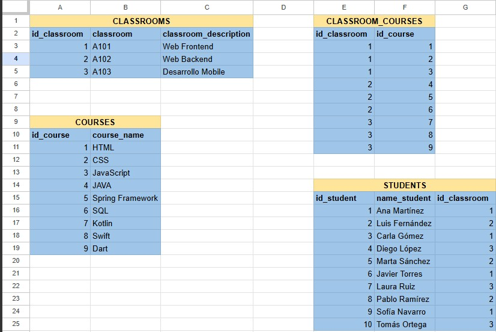
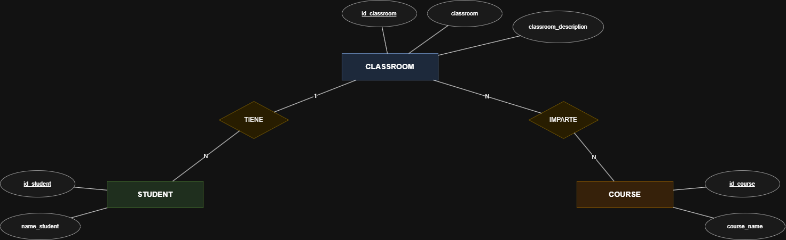
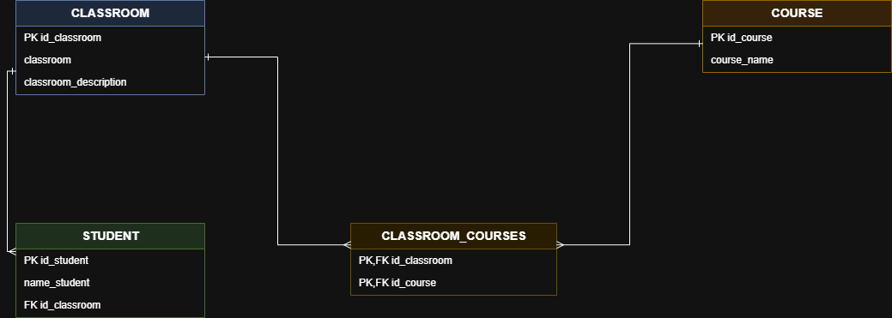
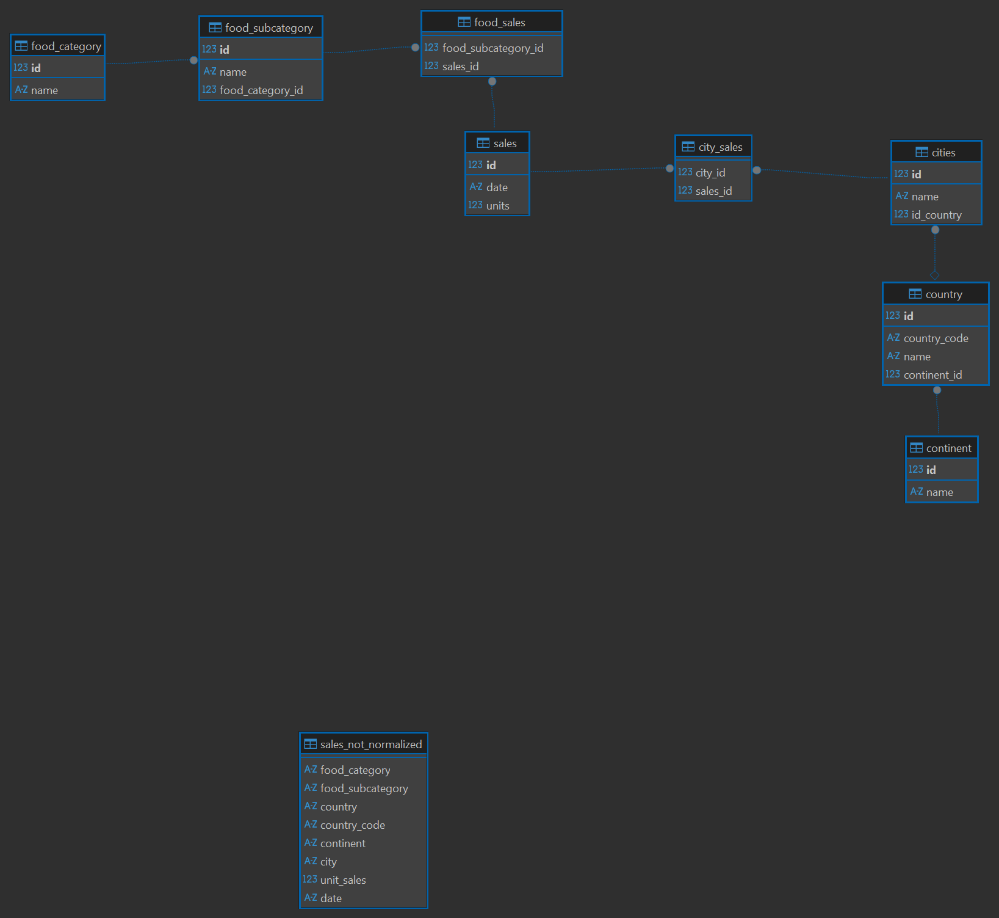
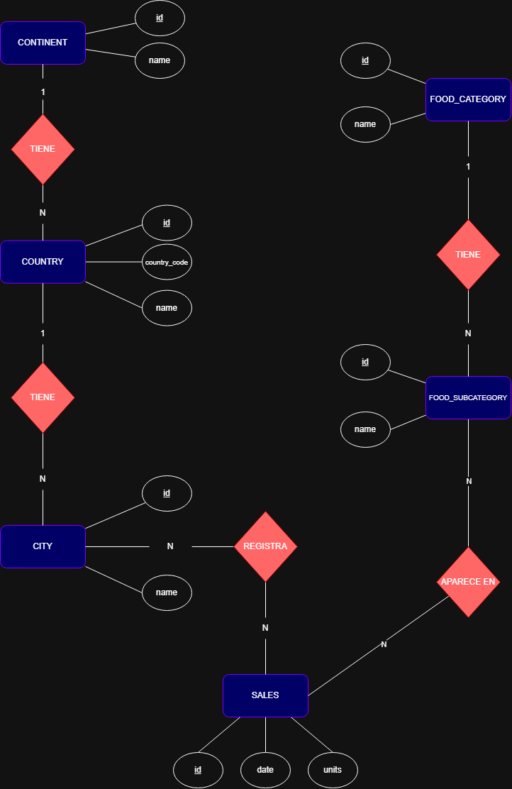

# SQL and Database exercises

## Students-Classrooms-Courses

### Requisitos:

- Descarga el PDF donde encontrarás una tabla de datos sin normalizar
- Normaliza la tabla
- Realiza un diagrama de ER de Chen
- Realiza un diagrama de tipo de patas de gallo

### Resultados:

| Descripción | Imagen |
| --- | --- |
| Normalización de tablas |  |
| Diagrama de Chen |  |
| Diagrama patas de gallo | 

---

## Any Company Global

### Requisitos:

- Crea una base de datos con SQLite con DBeaver. Nombre: db_any_company_global
- Crea la tabla "sales_not_normalized"
- Inserta los datos en la tabla creada
- Realiza un diagrama de la normalización de la tabla (diagrama de Chen)
- Noramliza la base de datos sin perder las relaciones en DBeaver
- Crea un script para obtener el país donde se realizó la venta con id `3`

### Resultados:

| Descripción | Imagen |
| --- | --- |
| Normalización de tablas   "sales not normalized"   Inserta los datos en la tabla creada | 
| Diagrama de Chen |  |
| [Script SQL](./doc/sql/Script.sql) | 